# HackatIOn 2025 - Dokumentacja

- **Data:** 11-13.04.2025
- **Skład zespołu:** Bartosz Buczek, Berard Gawor, Bartłomiej Kozak, Magdalena Pabisz, Olgierd Smyka, Bartłomiej Stylski
- **Nazwa zespołu:** 4BOM
- **Nazwa projektu:** Roomie

## Opis projektu

Naszym celem było stworzenie aplikacji, pomagającej studentom w znalezieniu współlokatora do akademika. Czerpaliśmy inspirację z popularnych aplikacjach randkowych, takich jak Tinder. Podczas rejestrecji użytkownik wypełnia szczegółowy formularz, który pozwla określić jego cechy osobowości i preferencje. Dzięki temu zapewniamy lepsze dopasowanie między potencjalnymi współlokatorami. Formularz obejmuje następujące aspekty:

### Informacje o użytkowniku

- harmonogram snu (godzina zasypiania i wstawania)
- zainteresowania i hobby (wybierane z listy)
- palenie papierosów (tak/nie/okazjonalnie)
- picie alkoholu (tak/nie/okazjonalnie)
- typ osobowości (skala: introwertyk – ekstrawertyk)
- rok studiów
- wydział (wybór z listy)
- status związku (tak/nie/to skomplikowane)

### Preferencje

- harmonogram snu (ma znaczenie lub nie)
- zainteresowania i hobby (ma znaczenie lub nie)
- palenie papierosów (tak/nie/okazjonalnie)
- picie alkoholu (tak/nie/okazjonalnie)
- typ osobowości (skala: introwertyk – ekstrawertyk)
- rok studiów (ma znaczenie lub nie)
- wydział (ma znaczenie lub nie)
- status związku (ma znaczenie lub nie)

Użytkownik może przeglądać profile innych osób, które zawierają kluczowe informację i wartość zgodności dopasowanie. Pierwotny pomysł zakładał interfejs użytkownika w stylu aplikacji randkowej, gdzie przesunięcie w prawo to nawiązanie interakcji z daną osobą, a przesunięcie w lewo oznacza pominięcie profilu. Pomysłu tego nie zdążyliśmy niestety w pełni zrealizować. W aktualnej wersji dostępne są przyciski pełniące te same funkcje. \
Gdy dwie osoby wzajemnie wyrażą chęć zamieszkania ze sobą, udostępniane są ich dane kontaktowe, umożliwiając dalszą rozmowę poza naszą aplikają. Użytkownik ma także możliwość w każdej chwili usunięcia swojego konta z systemu, jeśli nie jest już zainteresowany poszukiwaniem współlokatora.

### Kluczowe funkcje aplikacji

- rejestracja i logowanie
- szczegółowy formularz startowy zbierający informacje o preferencjach i cechach użytkownika
- system oceniający dopasowanie potencjalnych współlokatorów
- możliwość wysyłania zapytań do potencjalnych współlokatorów
- udostępnaianie danych kontaktowych w przypadku wzajemnego zainteresowania
- podgląd powiadomień
- podgląd danych użytkownika (swoich i innych osób)

### Algorytm sortujący

Do obliczania wartości dopasowania aplikacja wykorzystuje funkcję kosztu. Algortym analizuje różnice w preferencjach użytkownika oraz cechach potensjalnych współlokatorów, uwzględniając wagę każdego aspektu w zależności od opcji zaznaczonych przez użytkownika. Na przykład:\
Mniejsze różnice w harmonogramach snu powodują lepsze dopasowanie.\
Większe różnice w kwestii palenia lub picia alkoholu powodują obniżenie wartośi funkcji dopasowania.\
Profile potencjalnych współlokatorów są sortowane według obliczonej w ten sposób wartości. W pierwszej kolejności prezentowane są osoby o najwięszym stopniu zgodności.

## Zastosowane technologie

### Backend

- **Kotlin**  
  Główny język używany do programowania backendu. W projekcie wykorzystujemy `context receivers` do zarządzania zależnościami w sposób idiomatyczny i przejrzysty.

- **Ktor**  
  Asynchroniczny framework webowy stworzony używany jako główny serwer HTTP, obsługuje routing, autoryzację oraz middleware.

- **PostgreSQL**  
  Stabilna i wydajna relacyjna baza danych, wykorzystywana do przechowywania danych aplikacji.

- **Exposed**  
  Kotlinowy framework ORM do pracy z bazą danych. Korzystamy zarówno z DSL (Domain Specific Language), jak i DAO (Data Access Objects) w celu wygodnego i typowanego zarządzania encjami.

- **Testcontainers**  
  Biblioteka umożliwiająca uruchamianie izolowanych instancji PostgreSQL w kontenerach Dockerowych w trakcie testów integracyjnych.

- **Docker + Render**  
  Deployment aplikacji realizowany w podejściu _Infrastructure as Code_ z użyciem kontenerów Dockerowych oraz platformy Render do hostowania backendu.

- **Eksport modeli REST do TypeScript**  
  Automatyczne generowanie typów TypeScript z modeli Kotlinowych w celu zapewnienia spójności danych między backendem a frontendem.

- **Swagger / OpenAPI**  
  Backend automatycznie generuje dokumentację API w formacie OpenAPI, udostępnianą w formie interaktywnego Swagger UI.

- **Faker**  
  Biblioteka służąca do generowania losowych danych wykorzystywanych podczas testowania i developmentu.

### Frontend

- **React + TypeScript**  
  React jako biblioteka do budowy interfejsu użytkownika, w połączeniu z TypeScriptem który zapewnia silne typowanie a w konsekwencji większe bezpieczeństwo kodu.

- **Tailwind CSS**  
  Framework CSS, umożliwiający szybkie tworzenie nowoczesnych i responsywnych interfejsów użytkownika bez potrzeby pisania własnych klas CSS.

- **DaisyUI**  
  Biblioteka komponentów UI zbudowana na Tailwind CSS, dostarczająca gotowe do użycia komponenty.

- **v0**  
  Narzędzie do generowania makiet UI i inspiracji wizualnych, które przyspieszyło proces projektowania interfejsu.

## Uruchamianie aplikacji
Przed rozpoczęciem upewnij się, że masz zainstalowany Docker oraz że usługa Docker Daemon jest uruchomiona. Szczegółowe instrukcje znajdziesz w oficjalnej dokumentacji: [Uruchamianie Docker Daemon](https://docs.docker.com/engine/daemon/start/).

#### Uruchamianie w kontenerach

1. **Backend**:
   ```bash
   cd backend
   docker build -t backend-app .
   docker run -p 8080:8080 backend-app
   ```
2. **Frontend**:
   ```bash
   cd frontend
   docker build -t frontend-app .
   docker run -p 5173:5173 frontend-app
   ```

#### Uruchamianie lokalnie

1. **Backend**:
   ```bash
   cd backend
   ./gradlew build
   ./gradlew run
   ```
2. **Frontend**:
   ```bash
   cd frontend
   npm install
   npm run dev
   ```

#### Dostęp do aplikacji

Po uruchomieniu aplikacji frontendowej, otwórz przeglądarkę i przejdź pod adres:  
[http://localhost:5173/](http://localhost:5173/)  
Tam znajdziesz działającą aplikację webową.

## Proces powstawania projektu

### Piątek (11.04)

- określenie tematu i funkcjonalności aplikacji
- podział na podzespoły (frontend/backend)
- stworzenie repozytorium i projektów

### Sobota (12.04)

- **(Frontend)** projektowanie makiet UI
- **(Frontend)** przygotowanie formularza do logowania i rejestracji

- **(Frontend)** widok listy potencjalnych współlokatorów

- **(Frontend)** projektowanie formularza do zbierania preferencji i cech osobowości (pierwsze połączenie z backendem - lista hobby i dostępnych wydziałów)
- **(Frontend)** widok listy powiadomień
- **(Frontend)** widok profilu użytkownika
- **(Backend)** Integracja z in-memory bazą danych H2
- **(Backend)** Implementacja systemu oraz endpointów obsługujących rejestrację i logowanie użytkowników.
- **(Backend)** Opracowanie modelu danych przechowującego informacje o preferencjach oraz szczegółach użytkowników.
- **(Backend)** Wdrożenie systemu autentykacji użytkowników, zapewniającego bezpieczeństwo dostępu.
- **(Backend)** Stworzenie endpointów zwracających listę dostępnych wydziałów oraz hobby do wyboru.

### Niedziela (13.04)

- **(Frontend)** umożliwienie logowanie użytkownika
- **(Frontend)** wyświetlanie informacji o użykowniku pobranej z backendu
- **(Frontend)** wyświetlanie listy kandydatów pobranej z backendu
- **(Frontend)** umożliwienie rejestracji użytkownika (wysłanie informacji na backend)
- **(Frontend)** wyświetlanie powiadomień pobranych z backendu
- **(Frontend)** dodanie funkcjonalności zaproszenia i odrzucenia potencjalnego współlokatora (wysyłanie informacji na backend)
- **(Frontend)** możliwość wylogowania użytkownika
- **(Backend)** integracja modelu danych z danymi przesyłanymi przez frontend, zapewniająca spójność i poprawność informacji.
- **(Backend)** implementacja endpointów umożliwiających dodawanie informacji o użytkownikach oraz ich preferencji.
- **(Backend)** stworzenie mechanizmu oraz endpointów odpowiedzialnych za dopasowywanie użytkowników na podstawie ich preferencji.
- **(Backend)** implementacja endpointów obsługujących powiadomienia o wychodzących i przychodzących dopasowaniach.
- **(Backend)** opracowanie algorytmu obliczającego metrykę podobieństwa między użytkownikami, uwzględniającego ich preferencje i cechy.
- **(Backend)** Deployment i integracja z bazą danych PostgreSQL

## Wyzwania i probelmy

1. **Trudności w nauce nowych technologi**
   Niektóre osoby początkowo miały problemy z przyswojeniem nowych narzędzi. Między innymi, mało kto w zespole miał doświadczenie z technologiami frontendowymi. Udało nam się jednak sprawnie opanować potrzebne narzędzia, a osoby bardziej doświadczone technicznie potrafiły skutecznie pokierować pracami i doradzić przy rozwiązywaniu problemów.
2. **Problemy komunikacyjne między frontendem a backendem**  
   Brak jasnych ustaleń dotyczących kontraktów API i niedoprecyzowane wymagania skutkowały opóźnieniami i nieporozumieniami. Rozwiązanie polegało na oddelegowaniu dwóch osób (jedej z backendu i jedej z frontendu), aby wspólnie ustaliły potrzebne informacje.
3. **Nierównomierne tempo prac – backend wolniejszy niż frontend**  
   Z powodu większej złożoności oraz problemów z wdrożeniem technologii backendowych, ta część rozwijała się nieco wolniej.
4. **Rozwiązywanie merge conflictów**
   W trakcie rozwoju aplikacji pojawiały się konflikty, staraliśmy się więc nie dopuszczać do sytuacji, w której dwie osoby wprowadzają duże modyfikacje w tym samym pliku. Pozwoliło nam to zaoszczędzić czas na rozwiązywaniu potencjalnych konflików.

## Dokumentacja techniczna

<p align="center">

</p>

## Backend

### Struktura projektu

```
src/
├───main
│   ├───kotlin
│   │   └───edu.agh.roomie
│   │       ├───rest
│   │       │   ├───endpoints
│   │       │   └───model
│   │       ├───scripts
│   │       └───service
│   └───resources
│       └───openapi
└───test
    └───kotlin
        └───edu.agh.roomie
            ├───rest.endpoints
            └───service
```

### `./main/kotlin/edu.agh.roomie`

Główny pakiet kodu źródłowego. 

- **Application.kt** – punkt wejścia aplikacji
- **Databases.kt** – konfiguruje bazę (H2 lokalnie, PostgreSQL w produkcji), zawiera funkcję do generowania danych testowych

### `./main/kotlin/edu.agh.roomie.rest`

Zawiera konfigurację zależności, routingu oraz ustawień HTTP:

- **Dependencies.kt** – klasa przechowująca zależności (Services oraz Database)
- **HTTP.kt** – konfiguruje kompresję i CORS
- **Routing.kt** – konfiguruje obsługę błędów, negocjację treści, routing oraz integrację ze Swaggerem

### `./main/kotlin/edu.agh.roomie.rest.endpoints`

Zawiera definicje endpointów REST:

- **configureAuthRouting.kt** – konfiguruje endpointy związane z uwierzytelnianiem użytkowników (logowanie, rejestracja, wylogowanie, usuwanie konta)
- **configureInitialRouting.kt** – konfiguruje endpointy do rejestracji użytkowników, zarządzania ich preferencjami i dodatkowymi informacjami
- **configureMatchRouting.kt** – konfiguruje endpoint obsługujący odrzucanie i akceptowanie użytkowników
- **configureUserRouting.kt** – konfiguruje endpointy związane z użytkownikami (dane użytkownika, dopasowania, dostępne dopasowania)

### `./main/kotlin/edu.agh.roomie.rest.model`

Modele danych oraz funkcje wspierające logikę dopasowań użytkowników:

- **Auth.kt** – modele danych dla zapytań i odpowiedzi służące przesyłaniu danych pomiędzy frontend i backend
- **countScore.kt** – funkcja obliczająca dopasowanie między użytkownikami na podstawie ich preferencji i danych
- **Faculty.kt** - enum reprezentujący różne wydziały uczelni
- **Hobby.kt** - enum reprezentujący dostepne hobby
- **Info.kt** - przechowuje dane użytkownika, takie jak imię, wiek, preferencje itp.
- **Match.kt** - przechowuje dane dotyczące dopasowania użytkowników
- **Preferences.kt** - definiuje preferencje użytkownika
- **User.kt** - definiuje klasę danych użytkownika, konwertuje jego dane z formatu bazy danych do modelu aplikacji

### `./main/kotlin/edu.agh.roomie.scripts`

Skrypty pomocnicze:

- **exportRestModels.kt** - generuje typy TypeScript z klas danych Kotlin

### `./main/kotlin/edu.agh.roomie.service`

Logika biznesowa aplikacji, obsługa użytkowników, preferencji i dopasowań:

- **AuthService.kt** - generuje, weryfikuje i usuwa tokeny, przechowując je w mapie
- **FakeUserGenerator.kt** - generator testowych użytkowników wraz z ich danymi i preferencjami
- **InfoService.kt** - obsługuje operacje na tabeli InfosTable
- **MatchService.kt** - zarządza zaproszeniami do dopasowania użytkowników
- **PreferencesService.kt** - zarządza przechowywaniem preferencji użytkowników w PreferencesTable
- **UserService.kt** - zarządza użytkownikami w tabeli UsersTable 

### `./main/resources`

Zasoby konfiguracyjne aplikacji:

- **application.yaml** - plik konfiguracyjny aplikacji
- **logback.yaml** - plik konfiguracyjny logowania (Logback)

### `./main/resources/openapi`

Zawiera specyfikację OpenAPI dla wygenerowanej dokumentacji API:

- **documentation.yaml** - specyfikacja OpenAPI

### `./test/kotlin/edu.agh.roomie`

Pakiet pomocniczy do testów weryfikujących funkcjonalności aplikacji:

- **TestUtils.kt**

### `./test/kotlin/edu.agh.roomie.rest.endpoints`

Testy jednostkowe zdefiniowanych endpointów REST:

- **AuthRoutingTest.kt**
- **InitialRoutingTest.kt**
- **MatchRoutingTest.kt**
- **TestUtils.kt**
- **UserRoutingTest.kt**

### `./test/kotlin/edu.agh.roomie.rest.service`

Testy jednostkowe warstwy serwisów:

- **AuthServiceTest.kt**
- **FakeUserGeneratorTest.kt**
- **InfoServiceTest.kt**
- **MatchServiceTest.kt**
- **PreferencesServiceTest.kt**
- **UserServiceTest.kt**

### Zastosowane pomysły i wzorce projektowe
- **Separation of Concerns**
  
  Logika aplikacyjna została oddzielona od warstwy dostępu do danych i obsługi HTTP. Dzięki temu każda warstwa (serwisy, endpointy, modele) ma jasno określoną odpowiedzialność.

- **Dependency Injection**  

  Wstrzykiwanie zależności do serwisów i warstwy HTTP odbywa się poprzez context receivers oraz ręczne przekazywanie instancji w `Dependencies.kt`, co ułatwia testowanie i modularność.

- **Strategia obliczania dopasowania**  

  Funkcja `countScore.kt` realizuje strategię przypisywania wag i porównywania cech użytkowników. Dzięki enkapsulacji logiki oceny dopasowania w jednej funkcji łatwiej ją modyfikować lub rozszerzać.

- **Modularny routing**

  Routing został podzielony na pliki tematyczne (`configureAuthRouting`, `configureMatchRouting` itd.), co ułatwia orientację w kodzie i umożliwia łatwe zarządzanie punktami końcowymi.

- **Infrastructure as Code**

  Wdrożenie backendu oparte jest na kontenerach Docker i platformie Render. Podejście to zapewnia przenośność środowiska oraz spójność konfiguracji między lokalnym developmentem a produkcją.


## Frontend

### Struktura projektu

```
src/
├── apis/
├── authentication/
├── home/
├── MainApp/
├── preferences/
├── rest/
├── RoommatePreferences/
├── types/
└── App.tsx
```

### `./apis`

Zawiera logikę komunikacji z API:

- **authentication.ts** – obsługuje logowanie, rejestrację i wylogowanie użytkownika.
- **base.ts** – definiuje bazowy URL do zapytań API.
- **matches.ts** – zarządza zapytaniami dotyczącymi dopasowań (np. przesuwanie profili).
- **preferences.ts** – obsługuje zapytania związane z preferencjami i dodatkowymi informacjami użytkownika.
- **users.ts** – pobiera dane użytkowników i przetwarza odpowiedzi API związane z użytkownikami.

### `./authentication`

Zawiera strony związane z uwierzytelnianiem:

- **LoginPage.tsx** – formularz logowania użytkownika.
- **RegisterPage.tsx** – formularz rejestracji nowych użytkowników.

### `./home`

Zawiera stronę startową:

- **HomePage.tsx** – główna strona powitalna aplikacji.

### `./MainApp`

Zawiera kluczowe komponenty aplikacji:

- **DiscoverPage.tsx** – potencjalni współlokatorzy do dopasowania.
- **ListComponent.tsx** – komponent listy użytkowników wielokrotnego użytku.
- **MatchesPage.tsx** – dopasowani użytkownicy i oczekujące zaproszenia.
- **Navbar.tsx** – pasek nawigacji.
- **ProfilePage.tsx** – profil użytkownika i jego preferencje.
- **UserDetailModal.tsx** – modal ze szczegółowymi informacjami o użytkowniku.

### `./preferences`

Zawiera wieloetapowy formularz preferencji:

- **PreferencesPage.tsx** – główny komponent zarządzający logiką formularza; łączy poszczególne kroki i umożliwia wprowadzanie preferencji przez użytkownika.
- **StepN.tsx** – komponent odpowiadający za pojedynczy krok formularza, w którym użytkownik podaje konkretne informacje.

### `./rest`

Zawiera współdzielone modele danych generowane automatycznie przez backend:

- **model.auth.ts** – modele żądań i odpowiedzi związanych z uwierzytelnianiem.
- **model.ts** – modele danych użytkownika, preferencji i dopasowań.

### `./RoommatePreferences`

Zawiera formularze preferencji współlokatorów:

- **RoommatePreferencesPage.tsx** – główna strona ustawiania preferencji współlokatora.
- **StepOne.tsx** – formularz ogólnych preferencji (np. hobby, rok studiów).
- **StepTwo.tsx** – formularz preferencji związanych ze stylem życia.

### `./types`

Zawiera definicje typów TypeScript:

- **match.ts** – typy związane z dopasowaniami i ich statusami.
- **user.ts** – typy związane z danymi użytkownika i jego preferencjami.

### Zastosowane pomysły i wzorce projektowe

- **TypeScript**

  Dzięki typowaniu statycznemu minimalizujemy błędy w trakcie developmentu i zapewniamy większą czytelność kodu.

- **Responsive Design**

  Aplikacja została zaprojektowana z użyciem Tailwind CSS, co zapewnia responsywność i łatwość w dostosowywaniu stylów.

- **Reusable Styles with Tailwind CSS + DaisyUI**

  Wykorzystano DaisyUI, czyli bibliotekę komponentów opartą na Tailwind CSS, co pozwoliło na szybkie tworzenie spójnego interfejsu użytkownika.

## Co można było zrobić lepiej

- **Spójna architektura frontendu**

  Ze względu na charakter wydarzenia, który wymagał szybkiego dostarczenia działającego rozwiązania, nie została ustalona wspólna wizja struktury projektu ani jednolity sposób jego implementacji. W rezultacie poszczególne części aplikacji zostały zaimplementowane w oparciu o różne podejścia i wzorce, co negatywnie wpłynęło na spójność oraz czytelność ogólnej architektury projektu.

- **Szersze wykorzystanie wzorców projektowych**

  Podczas tworzenia frontendu warto było w większym stopniu zastosować sprawdzone wzorce projektowe – m.in. podział na małe, wielokrotnego użytku komponenty oraz wyraźne rozgraniczenie komponentów prezentacyjnych i kontenerowych. Taka struktura ułatwiłaby dalszy rozwój aplikacji, zwiększyła czytelność kodu i ograniczyła jego powielanie poprzez ponowne wykorzystanie istniejących elementów.
